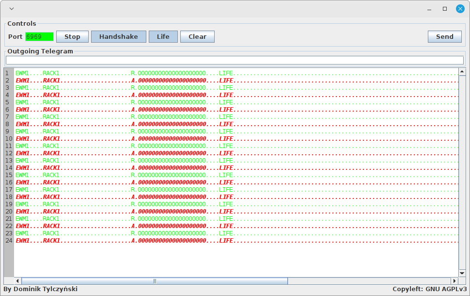
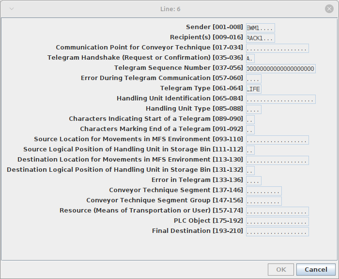

# Introduction
PLC Sim is a free, open source, platform independent tool to test SAP EWM MFS connectivity and facilitate SAP EWM MFS implementation projects.

The software has been made available under copyleft [GNU Affero General Public License v3.0](https://github.com/dominik-tylczynski/mfs-plc-sim/blob/master/LICENSE)

# Main Features
The current release of PLC Sim supports:
- Optional automatic telegram acknowledgment with handshake response
- Optional LIFE telegrams filtering
- Multiple communication channels
- Structural display of telegrams with dynamic determination of the telegram structure from SAP data dictionary
- Direct TCP/IP (ABAP Push Channel) and SAP Plant Connectivity PLC communication layers
- Configurable handshake request and response indicators
- Configurable telegram structure
- Configurable switching of sender and receiver fields in handshake response telegrams
- Configurable telegrams logs styling based on telegram types and handshake indicators
- Application logging implemented with Apache log4j2 library

# Architecture and Usage
PLC Sim consist of two independent Java applications working together

## PLC simulation application
It implements a TCP/IP server that receives and sends telegram messages either directly to SAP EWM MFS through ABAP Push Channel or indirectly through a RFC connectivity adapter like SAP PCo or *TCP/IP-RFC bridge* that is part of the project.

The application is implemented with the *Sim* class and is operated with a single window.

Double click on a telegram line brings a structural telegram display/edit dialog

 

The application is started with two arguments:

- SAP destination Id as defined with a *<ID>.jcoDestination* properties file - refer to SAP JCo [documentation](https://support.sap.com/en/product/connectors/jco.html?anchorId=section_1355144687) on how to define it
- the application configuration properties file

## TCP/IP-RFC bridge
The bride implements an intermediate communication layer between SAP RF and TCP/IP server. The application is implement with the *Bridge* class. It is started with two arguments:

- RFC server Id as defined with a *<ID>.jcoServer* properties file - refer to SAP JCo [documentation](https://support.sap.com/en/product/connectors/jco.html?anchorId=section_1355144687) on how to define it
- the application configuration properties file 

While running the bridge supports the following console commands:

- help, ? - displays help message with supported commands
- status - prints the RFC server and communication channels statuses
- stop, exit, bye - stops and exits the bridge

The commands are case insensitive.

## Configuration properties file
Both components can be customized with a single properties file.

|Property|Used by|Description|Sample value|
|---|---|---|---|
|telegramStructure|simulation app|SAP data dictionary structure that defines telegram structure as defined in SAP MFS configuration|ZMFS_TELESHORT|
handshakeRequest|simulation app|Handshake request identifier as defined in SAP EWM-MFS configuration of communication channels. If one character identifier is defined in SAP EWM-MFS configuration and fill character is also defined there, then the identifier needs to be followed by the fill character in the properties file, e.g. if R identifier and . (dot) fill character are customized in SAP EWM-MFS, then R. has to be specified in the properties file.|R.|
|handshakeConfirmation|simulation app|Handshake confirmation identifies as defined in SAP MFS configuration of communication channels. See the remarks above on handshake identifiers and fill character dependency.|A.|
|switchSenderReceiver|simulation app|Defines whether sender and recipient are to be switched during telegram confirmation. The setting has to correspond to SAP EWM-MFS communication channel configuration|false|
|sendingFM|bridge app|Name of the sending function module for B "Proprietary Communication Layer"|Not used - see [Current Limitations](https://github.com/dominik-tylczynski/mfs-plc-sim/blob/master/mfs-plc-sim/README.md#current-limitations)|
|startingFM|bridge app|Name of the starting function module for B "Proprietary Communication Layer"|Not used - see [Current Limitations](https://github.com/dominik-tylczynski/mfs-plc-sim/blob/master/mfs-plc-sim/README.md#current-limitations)|
|stoppingFM|bridge app|Name of the stopping function module for B "Proprietary Communication Layer"|Not used - see [Current Limitations](https://github.com/dominik-tylczynski/mfs-plc-sim/blob/master/mfs-plc-sim/README.md#current-limitations)|
|statusFM|bridge app|Name of the status function module for B "Proprietary Communication Layer"|Not used - see [Current Limitations](https://github.com/dominik-tylczynski/mfs-plc-sim/blob/master/mfs-plc-sim/README.md#current-limitations)|
|Style.*type*-*handshake*|simulation app|Telegram log styling properties, e.g. the property Style.LIFE-R. defines style for LIFE telegram, handshake indicator R. (handshake request). The property value is composed of RGB font color definition and font style e.g. **0,255,0,BI** means color: R=0,G=255,B=0, bold and italic font. Font styling letters: B - bold, I - italic, S - strike through, U - underline|255,0,0,BI|

## log4j2 configuration
PLC Sim logging is customized with Apache log4j2 [configuration](https://logging.apache.org/log4j/2.x/manual/configuration.html). By default, the library looks for a configuration file named **log4j2.xml** the classpath. The configuration file can also be specified with the system property **-Dlog4j.configurationFile=path/log4j2.xml**

A sample **log4j2.xml** file is provided in the project.

# Dependencies
PLC Sim has been implemented with:
- Apache [log4j2](https://logging.apache.org/log4j/2.x/) library
- SAP [Java Connector](https://support.sap.com/en/product/connectors/jco.html)

# Current Limitations
- PLC communication layer type B "Proprietary Communication Layer" is not supported yet
- One telegram structure only - all telegram types have to have the same structure
- Channel synchronization is not implemented yet
- PLC Sim is not localized yet. English version is implemented.
- Life telegram has to be of LIFE type.
- Login credentials for SAP Java Connectors need to be defined in a JCo properties file.

# Resources
[WMexperts.online blogs on SAP EWM MFS](https://wmexperts.online/author/hschultebahrenberg/)

[Blog Series about the Material Flow System Component of SAP Extended Warehouse Management](https://blogs.sap.com/2020/11/20/blog-series-about-the-material-flow-system-component-of-sap-extended-warehouse-management/)

[SAP Java Connector](https://support.sap.com/en/product/connectors/jco.html)

# Acknowledgments
I would like to express my deepest gratitude to:
- [Victor Cerullo](https://www.linkedin.com/in/victor-cerullo-8942072/) - his [PLC Emulator](http://www.venetica.net/Sites/PLC_Emulator/PLC_Emulator.html) has inspired this project.
- [Jörg Michaelis](https://www.linkedin.com/in/j%C3%B6rg-michaelis-82663766/) - his [Blog Series about the Material Flow System Component of SAP Extended Warehouse Management](https://blogs.sap.com/2020/11/20/blog-series-about-the-material-flow-system-component-of-sap-extended-warehouse-management/) has been an invaluable introduction to the configuration and workings of SAP EWM MFS.
- [Hendrik Schulte-Bahrenberg](https://www.linkedin.com/in/hendrik-schulte-bahrenberg-9a415339/) whose [WMexperts.online blogs](https://wmexperts.online/author/hschultebahrenberg/) have provided all-important technical insights into SAP EWM MFS inner working.
- Countless Java experts and enthusiasts who share their knowledge on the net.

This project would have not been possible without them.
